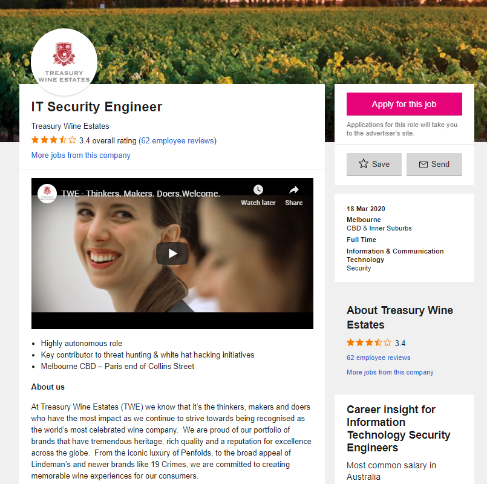
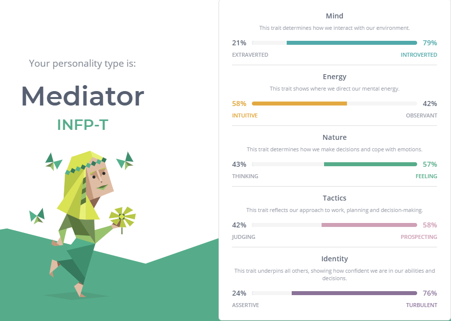
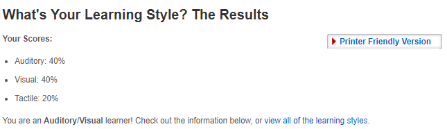
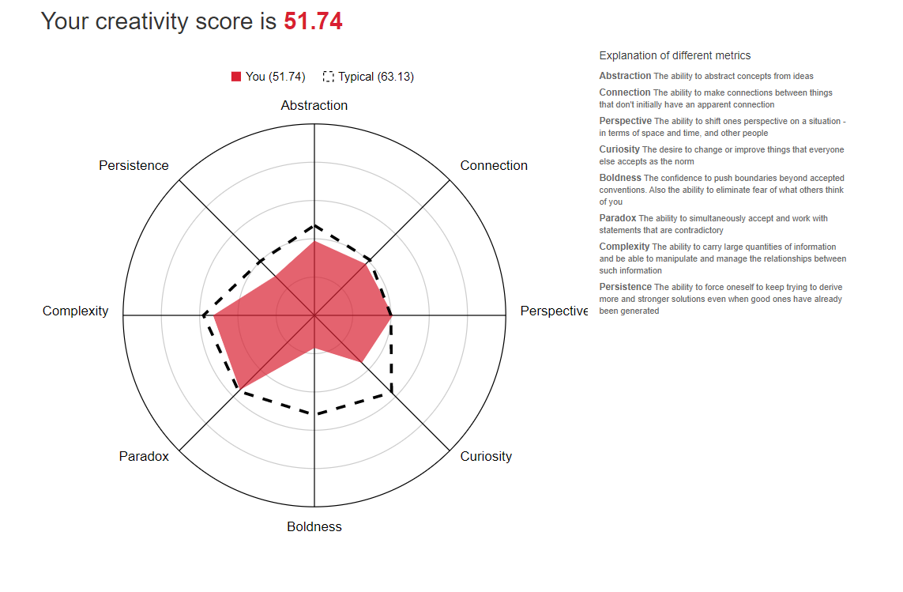

## Welcome to my Profle

Welcome to my profile for assignment 1 for IT, in this page you will learn about me, my intrsests in IT, Ideal job, a project idea of my own and variouse other things. 

### About me

Hello my name is Mitchell, My Student ID is S3856807 and my student email is S3856807@student.rmit.edu.au. I am currently 20 years old and i live in Melbourne Victoria. I was born in 1999 in south australia and moved up to the Northern Territory when i was 3 years old. I lived there for 10 years then moved down to New south wales. I continued to live there for about 3 more years and later moved to the final location where i am now, Victoria. My family consists of my Mom,Dad and little brother tyler. My Dad was born in England and moved over here when he was 10 while my Mum was born and raised here in Australia. My education to date consists of completing my VCE and graduating year 12 and also having a cert IV in Interactive Digital media.I have a white Shih Tzu named Oscar and my inrests include Photography and Gaming.An intresting fact about myself is that i have a massive scar behind my left ear which is due to a surgery i had when i was 15 where my inner ear was completely reconstructed due a Cholesteatoma. 

### Inrest in IT

##### What is my Inrest in IT?
My intrest in IT started when i was about 7-8 years old when i started doing IT at my local Primary School. I have always liked being around technology and IT since i was young age due to my intrest in Online games. I have never been a big Physical/Sport person as i dont enjoy it nor am i actually good at it. IT on the other hand has always captured my attention and i have always been drawn close to it. Every chance i got i would do the class in school as it was honestly what i enjoyed most. I dont have that much a lot of IT experience in terms of work experience but i do occasionly help friends with Computers such as repairing them and variouse other things.

##### What Did i choose RMIT?
I was oringally looking at RMIT when completing Year 12 VCE but decided to go with La Trobe as it had the same course and my best friends was also going there so that helped since i have anxiety and having my best friends with me would have helped it. Although after finding out i was moving to Ballarat which was now a 6 hour trip there and back for 4/5 times a week it become too expensive and required to much effort then it was worth. I defered from it for a year and later discovered OUA (Open Universities Australia) and found out that i can study online. I looked through the courses and Unis that offer this and came across RMIT. I chose it and here i am now.

##### What Do i expect to learn from my Studies?
Currently i am only doing 2 units. Introduction to Information Technology and Introduction to Programming. But what i expect to learn from my time at RMIT would mainly be the required and essential skills for a career within the IT industry. And inturms of my current Units i am studying would mainly be a general idea of each of the different routes i can take within IT and which subjects i can look further into and study more off.

### Ideal Job

##### What is my ideal job?
Although i havent got an exact idea on what i want my ideal job to be i have looked through some sites and have seen some jobs within the IT industry that have gotten my attention. After looking at Seek.com i have found a job that i may be intrusted in. Its a job offer for an IT Security Engineer at Treasury Wine Estates I will put an imagine of the job offer towards the end of this part of my profile. The reason this job is somewhat appealing to me is the fact that its in the security department, I have always been fond if Cyber/IT Security and my parents keep hastleing me to go into that department. So i feel as if this job is something that i would actually enjoy doing and not something that i will despise and not want to do.

##### What Skills will i neeed for the job?
from looking over the job advertisement i have discovered that i would need extensive experience within the security operations department as well as have extensive knowledge on different security products. It also lists that i will need epericen in now only log management or SIEM technologies but will also need to bve able to perform host-based forenseics that allowes to detect malicous artifacts. Lastly which isnt needed but to get a better chance at getting the job i will need to get a industry cerficicate.

##### What Skills do i currneltly have?
As it currently stands i do not have the required skills for the job in question. from the list of skills that i will need the only one that i have a somewhat understanding of is knowledge on different securty products. And even then its not that extensive as its only basic knowledge. but im hoping from the completing my uni course i will be able to get some more knowledege and meet the required skills in question.

##### How will i achieve the Skills?
My current plan to get the skills required for the job in question primarily revolves around my uni courses. I am hoping that from these courses i will get a better grasp at the cyber security department and learn some valuable skills that will allow me to perform my job to the best it can be.

### Peronsal profile

##### Myers-briggs test

##### Learning style test

##### Creativity test

##### What do these results mean to me?
personally i dont really like doing these tests as i like to think i know what i would be for each. But when the results come back with something i didnt expect i feel like i dont know really know if i should believe them or doubt myself. This puts a little bit of strain on me as i will constantly think about wether or not the tests actaully are correct or not.

##### How will these results affect my behaviour?
The results from this test wont really affect how i behave in a team or a social setting as im not the type of person to how i act or behave just on what someone or something says. I may ask some of my close friends wether or not i should change so and so. But most of the time i will just end up staying the same as i am unless someone specifically asks me to act a certain way for a certain ocasion such as a formal ocasion. 

##### How should i take this into account when forming a team
As stated earlier i wont really change as much unless the occasion calls for it. But i will inform my team that for example im not the type of person to talk a lot and hopefully they understand that and do the talking insted.

### Project Idea
##### Overview
Essentially its a phone and desktop app that allowes you to type in certain keywords or phrases to help you find a certain video game to play or a new one to play. The app will scan all the big online games stores such as steam, epic games launcher, Blizzerd net, Origin and Uplay. One scanned you can input certain phrases or keywords and the system will scan for a game that is similar to what you wrote into the app. for example i could say Building, Survival, Player vs Player and it would recommend me a game such as Rust which is a survial game where you can build and fight other players
##### Motivation
Whenver i finish playing a game or beating a game i always wonder to myself what will i play next. More often then not i usually look for a game that has similar playstyles or characteristics to the game i recently played or beat. It's quite dificult for me to find a new game as there are many differnet stores that sell different games so its quite hard to find one. Whenever i google certain topics for games i always come up with the same 10 games over and over again. So with this app i would able to find games that i wouldnt normally find when googleing games.
##### Description
When you first open the up on your desktop or phone you will be given a check box of sorts for the different online game stores there are around. for a start there will about 3-4 stores but over time more stores will be added. You then select which stores you want the app to search as some people may not be able to access certain stores. After the store selection screen is done you will then be taken to another screen when you can select certain game catagories, Eg. Survival, MMO or FPS games. after that you will be able to choose whether you want to search using those criteria or you can do a advance search where you can put in game names or something relating to that game such as something along the lines as a quote from the game or a quick description of the game. You will then be able to search and it will come up with a list of games it recommends. There will be a picture of the game to the right and a small discription of it the left. If you click on the game it will bring up a new page where it will be more indepth description of the game and give you a website link to the stores that are selling the game as many stores may sell the same game. You will also be able to mark a game as played so it wont show up if you search for the same catagories to signify you have played this game. To do this you will need to make a account which is simple email and password. This allows you to keep track of the games you have played both on your mobile phone/portable device and at your home computer. Another useful addition to the app is that when you go to view a game you can search for similar titles. This allowes the user to find similar games to ones the recently played without having to go through massive lists of games under the same catagorie. You could also use the app as a library or record as sorts to keep track of all the games you played. Although this isnt the intended feature it can certainly be used this way. Overall the app is would do a great deal of effort in the hands of people who play video games aswell as people wanting to get into games.
##### Tool and Technologies
Firstly you will need a computer that is running a operating system such as Windows, MacOS and Linux.  You will also need the correct software that allows you to code in. You can use several different program languages to program the software the most common are Python, Java, HTLM and C++. Some software that uses these codes are the following MVS (Microsft Visual Studio), Notepad++,and Eclipse. You could also use Dreamweaver potentioally but that is mainly for web developing.
##### Skills Required
You will need a fair amount of Skill in programming using your desired codeing language. In turms of hardware as stated above you will need a working computer with working internet and the correct software installed to get started. If you dont already have a computer with internet it could be quite fesable depending on what computer you buy. You could buy a really powerful computer that costs thousands of dollors or you could buy a cheap computer that can be under $100 so it really depends how much many you have/want to spend.
##### Outcome
If the project is successful and app is developed as intended. Gamers around the world will be able to use this app with ease to help with finding a new video game to play. Ontop of that if it is well recieved I could potentioally make one for movies, tv shows or books so everyone will be able to find this app helpful one way or another.

